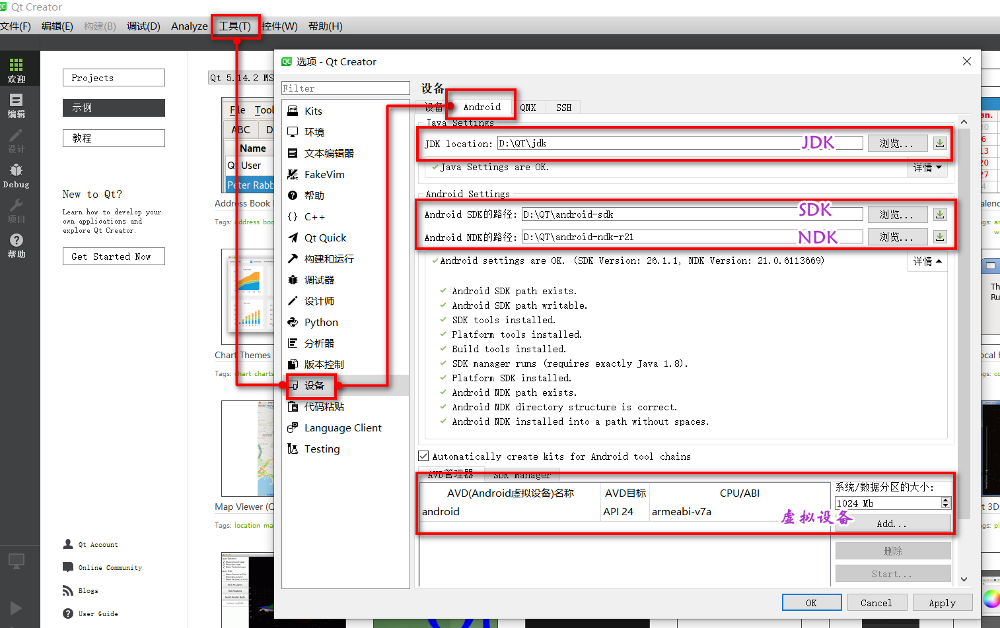
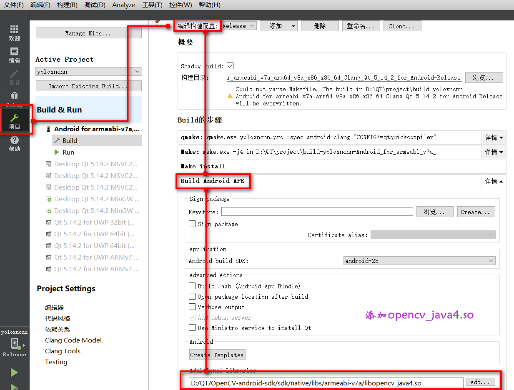
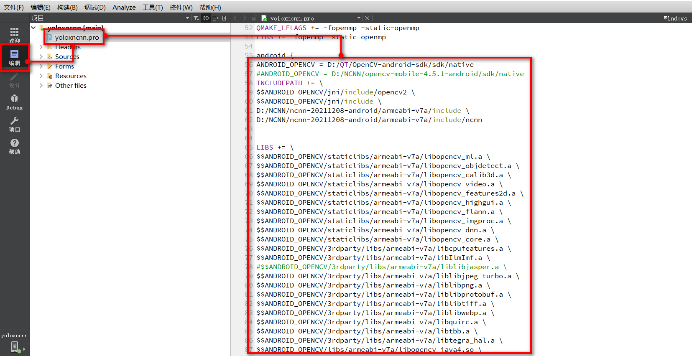
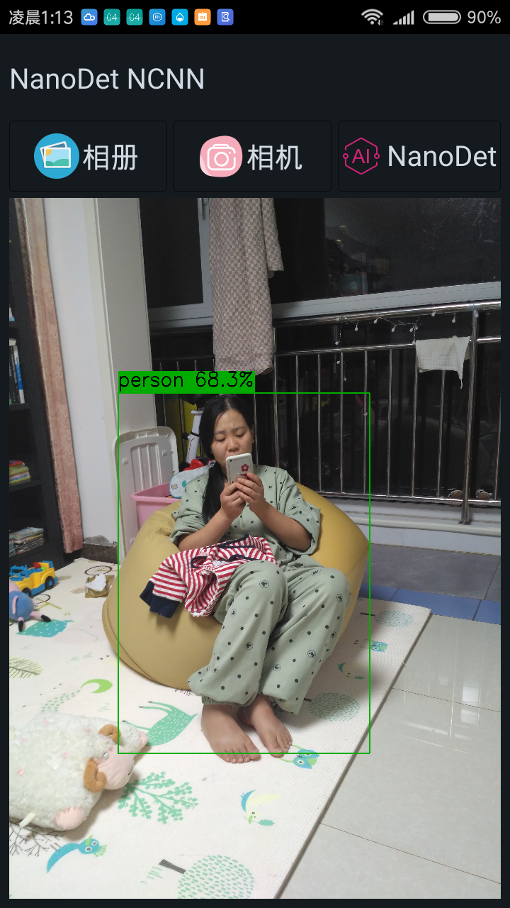
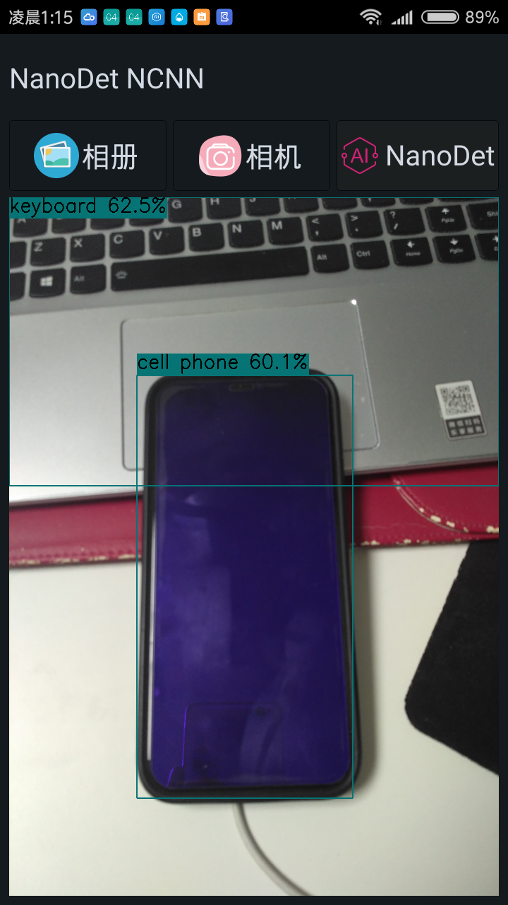

## Win10下QT+NCNN实现Android开发的踩坑记录

**Xu Jing**

### 1.我为什么选择QT和NCNN？

作为算法工程师，比较惭愧的告诉大家我对JAVA不是很熟悉，对android和ios等移动端设备的开发也知之甚少，我有过的经验就是用Python的Kivy开发过若干Android程序，
用QT5的C++和Python版本开发过Windows和Linux桌面程序，同时研究过很多很多深度学习相关的算法，对深度学习模型的部署有一些研究心得，NCNN号称是在在移动端推断速度最快
的开源框架，我很想尝试一下。
为了尝试NCNN在移动端的部署，查了一圈资料基本都是Java+NCNN的栗子。没办法，我只能选择QT+NCNN。

+ 该项目的代码和编译的配置环境我将完全开源，希望对一些像我一样的小伙伴有帮助
+ 手摸手从零开始的环境搭建，干净又卫生

### 2.环境搭建

+ 1.QT: qt 5.14.2
+ 2.JDK: jdk8
+ 3.Android NDK: android-ndk r21
+ 4.Android JDK
+ 5.Opencv Android:opencv-4.1.0-android-sdk
+ 6.NCNN: ncnn-20211208-full-source.zip

### 3. QT编译环境配置

#### #1.QT Android环境配置

该部分我们参考了B站教程：<https://www.bilibili.com/video/BV1tK41157F6?from=search&seid=15718933040668577581&spm_id_from=333.337.0.0>.

+ 下载section 1中的环境
+ 安装JDK8
+ 解压android-ndk r21
+ 解压android-jdk
+ 按照如下图配置QT

:zap: 为什么选择qt5.14.2和android-ndk r21 ?

为了方便和NCNN结合，在使用NCNN时发现

1. 用较低版本NDK编译失败，亲测用r15c可以，如果需要vulkan，需要ndk18以上，但是18以上不支持gcc了，默认clang
2. 较低版本Qt用gcc，高版本用clang，因此高版本应当可以直接用官方公布的最新的编译好的库，用不了的话再自己编译

因此我们选择了qt5.14.2和android-ndk r21.

#### #2.QT OpenCV Android环境配置

我们尝试了opencv-android-sdk的不同版本，发现在qt5.14.2下opencv-4.1.0-android-sdk是可以正常工作的，因此我们最终选择opencv-android-sdk

+ 解压opencv-4.1.0-android-sdk.zip
+ 打开QtCreater按照如下步骤配置opencv的编译环境

:zap: 为什么没有选择 opencv-mobile ?

#### #3.NCNN vs2019编译

#### #4.NCNN Android编译

!> 为什么要选择重新编译ncnn ?

### 4. 你以为这样就OK了吗？

+ 问题1： opencv和ncnn的问题

+ 问题2： assets导致的模型加载不了

+ 问题3：libomp.so的问题

### 5.关于代码部分的一些说明

+ ncnn模型部分不应该这样应该有个模型类实现并在程序开启时加载模型

+ 没有使用Android GPU和Valkan，编译部分为了简单起见我都关闭掉了

+ 怎样解决像YOLO v5或YOLOX这种调用自定义层的方式

+ 为什么没有选择qml

### 6.吸收了哪些大神们的精华

+ nihui的知乎

+ 知乎大佬多ncnn的总结

+ ncnn的官方repo: <https://github.com/Tencent/ncnn>

+ ncnn的模型仓库

+ ncnn的编译

+ QT+ opencv android的配置

+ QT+ncnn的配置

+ QT安卓环境配置:<https://www.bilibili.com/video/BV1tK41157F6?from=search&seid=15718933040668577581&spm_id_from=333.337.0.0>

+ QT opencv环境配置

+ QT 修改android程序的图标

+ QT打包文件到安卓程序

+ QT打开安卓相册

+ QT打开adroid摄像头

+ libomp。so的问题解决

+ assets问题解决

### 7. `F**K ` QT + NCNN终于成功在小米手机上跑起来了

+ 打开相册进行识别

+ 打开摄像头进行识别

### 8. APK下载

:bug: [APK-Download](https://github.com/DataXujing/Qt_NCNN_NanoDet/releases/download/untagged-72f6072efe822df13658/nanodet-ncnn-release.apk)

