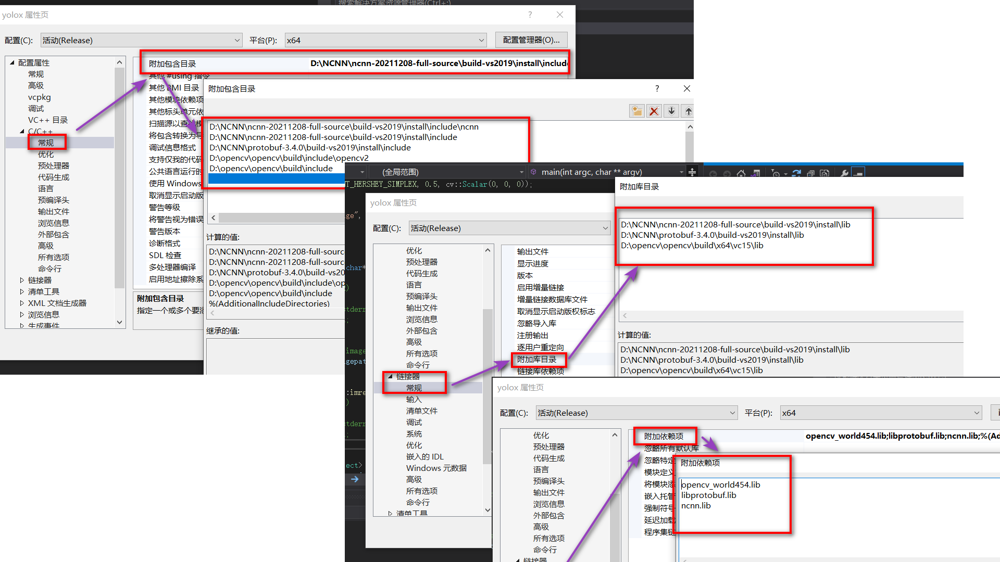
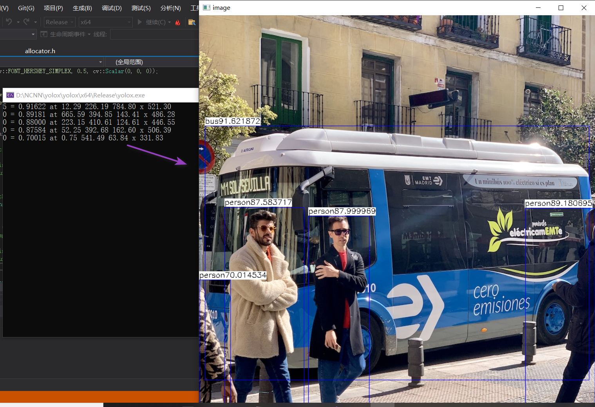
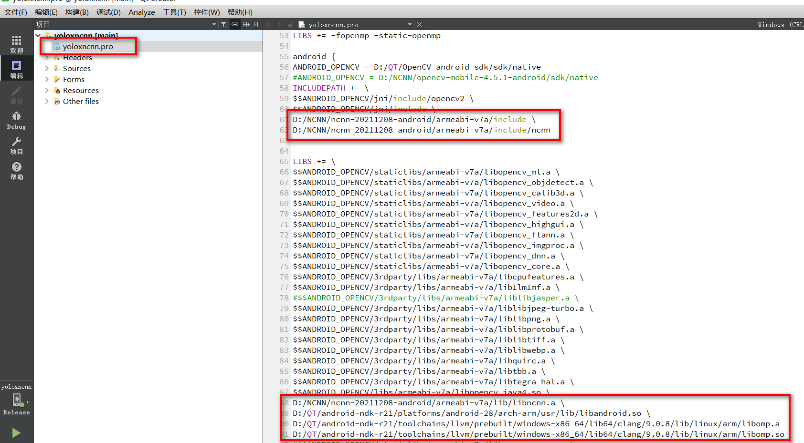
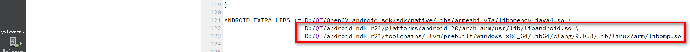

## Win10下QT+NCNN实现Android开发的踩坑记录

**Xu Jing**


### 1.我为什么选择QT和NCNN？

作为算法工程师，比较惭愧的告诉大家我对JAVA不是很熟悉，对android和ios等移动端设备的开发也知之甚少，我有过的经验就是用Python的Kivy开发过若干Android程序，
用QT5的C++和Python版本开发过Windows和Linux桌面程序，同时研究过很多很多深度学习相关的算法，对深度学习模型的部署有一些研究心得，NCNN号称是在在移动端推断速度最快
的开源框架，我很想尝试一下。
为了尝试NCNN在移动端的部署，查了一圈资料基本都是Java+NCNN的栗子。没办法，我只能选择QT+NCNN。

+ 该项目的代码和编译的配置环境我将完全开源，希望对一些像我一样的小伙伴有帮助
+ 手摸手从零开始的环境搭建，干净又卫生


### 2.环境搭建

+ 1.QT: qt 5.14.2
+ 2.JDK: jdk8
+ 3.Android NDK: android-ndk r21
+ 4.Android JDK
+ 5.Opencv Android:opencv-4.1.0-android-sdk
+ 6.NCNN: ncnn-20211208-full-source.zip


### 3. QT编译环境配置

#### #1.QT Android环境配置

该部分我们参考了B站教程：<https://www.bilibili.com/video/BV1tK41157F6?from=search&seid=15718933040668577581&spm_id_from=333.337.0.0>.

+ 下载section 1中的环境
+ 安装JDK8
+ 解压android-ndk r21
+ 解压android-jdk
+ 按照如下图配置QT


:zap: 为什么选择qt5.14.2和android-ndk r21 ?

为了方便和NCNN结合，在使用NCNN时发现

1. 用较低版本NDK编译失败，亲测用r15c可以，如果需要vulkan，需要ndk18以上，但是18以上不支持gcc了，默认clang
2. 较低版本Qt用gcc，高版本用clang，因此高版本应当可以直接用官方公布的最新的编译好的库，用不了的话再自己编译

因此我们选择了qt5.14.2和android-ndk r21.


#### #2.QT OpenCV Android环境配置

我们尝试了opencv-android-sdk的不同版本，发现在qt5.14.2下opencv-4.1.0-android-sdk是可以正常工作的，因此我们最终选择opencv-android-sdk

+ 解压opencv-4.1.0-android-sdk.zip
+ 打开QtCreater按照如下步骤配置opencv的编译环境


为了方便大家配置，下面提供文本供复制
```
android {
ANDROID_OPENCV = D:/QT/OpenCV-android-sdk/sdk/native
#ANDROID_OPENCV = D:/NCNN/opencv-mobile-4.5.1-android/sdk/native
INCLUDEPATH += \
$$ANDROID_OPENCV/jni/include/opencv2 \
$$ANDROID_OPENCV/jni/include \
D:/NCNN/ncnn-20211208-android/armeabi-v7a/include \
D:/NCNN/ncnn-20211208-android/armeabi-v7a/include/ncnn


LIBS += \
$$ANDROID_OPENCV/staticlibs/armeabi-v7a/libopencv_ml.a \
$$ANDROID_OPENCV/staticlibs/armeabi-v7a/libopencv_objdetect.a \
$$ANDROID_OPENCV/staticlibs/armeabi-v7a/libopencv_calib3d.a \
$$ANDROID_OPENCV/staticlibs/armeabi-v7a/libopencv_video.a \
$$ANDROID_OPENCV/staticlibs/armeabi-v7a/libopencv_features2d.a \
$$ANDROID_OPENCV/staticlibs/armeabi-v7a/libopencv_highgui.a \
$$ANDROID_OPENCV/staticlibs/armeabi-v7a/libopencv_flann.a \
$$ANDROID_OPENCV/staticlibs/armeabi-v7a/libopencv_imgproc.a \
$$ANDROID_OPENCV/staticlibs/armeabi-v7a/libopencv_dnn.a \
$$ANDROID_OPENCV/staticlibs/armeabi-v7a/libopencv_core.a \
$$ANDROID_OPENCV/3rdparty/libs/armeabi-v7a/libcpufeatures.a \
$$ANDROID_OPENCV/3rdparty/libs/armeabi-v7a/libIlmImf.a \
#$$ANDROID_OPENCV/3rdparty/libs/armeabi-v7a/liblibjasper.a \
$$ANDROID_OPENCV/3rdparty/libs/armeabi-v7a/liblibjpeg-turbo.a \
$$ANDROID_OPENCV/3rdparty/libs/armeabi-v7a/liblibpng.a \
$$ANDROID_OPENCV/3rdparty/libs/armeabi-v7a/liblibprotobuf.a \
$$ANDROID_OPENCV/3rdparty/libs/armeabi-v7a/liblibtiff.a \
$$ANDROID_OPENCV/3rdparty/libs/armeabi-v7a/liblibwebp.a \
$$ANDROID_OPENCV/3rdparty/libs/armeabi-v7a/libquirc.a \
$$ANDROID_OPENCV/3rdparty/libs/armeabi-v7a/libtbb.a \
$$ANDROID_OPENCV/3rdparty/libs/armeabi-v7a/libtegra_hal.a \
$$ANDROID_OPENCV/libs/armeabi-v7a/libopencv_java4.so \
D:/NCNN/ncnn-20211208-android/armeabi-v7a/lib/libncnn.a \
D:/QT/android-ndk-r21/platforms/android-28/arch-arm/usr/lib/libandroid.so \
D:/QT/android-ndk-r21/toolchains/llvm/prebuilt/windows-x86_64/lib64/clang/9.0.8/lib/linux/arm/libomp.a \
D:/QT/android-ndk-r21/toolchains/llvm/prebuilt/windows-x86_64/lib64/clang/9.0.8/lib/linux/arm/libomp.so

# opencv-mobile配置 已废弃
#$$ANDROID_OPENCV/staticlibs/armeabi-v7a/libopencv_core.a \
#$$ANDROID_OPENCV/staticlibs/armeabi-v7a/libopencv_features2d.a \
#$$ANDROID_OPENCV/staticlibs/armeabi-v7a/libopencv_highgui.a \
#$$ANDROID_OPENCV/staticlibs/armeabi-v7a/libopencv_imgproc.a \
#$$ANDROID_OPENCV/staticlibs/armeabi-v7a/libopencv_photo.a \
#$$ANDROID_OPENCV/staticlibs/armeabi-v7a/libopencv_video.a \

# add other file to assets

data.files += pic/nanodet.png
data.files += pic/ai.png
data.files += pic/carmera.png
data.files += pic/picture.png
data.files += pic/bus.jpg
data.files += model/nanodet_m.param
data.files += model/nanodet_m.bin

data.path = /assets/pic
INSTALLS += data

}
```


:zap: 为什么没有选择 [opencv-mobile](https://github.com/nihui/opencv-mobile) ?

首先要说明一下，为什么在opencv-android-sdk正常编译的情况下考虑使用opencv-mobile,原因有两个其中一个原因是opencv-mobile比opencv-android-sdk要小，且包含了我们常用的一些opencv功能,比如：

+ 提供 android 和 ios 平台最小化编译的 opencv 库
+ 提供 opencv 2.4.13.7 和 3.4.13 和 4.5.1 三种版本的预编译包
+ 提供官方 opencv 缺少的 ios bitcode 版本的预编译包
+ 包含基础的 opencv Mat 和矩阵操作，常用的图像处理功能
+ 禁用了 C++ RTTI 和 exceptions

第二个原因是最主要的原因，就像上述最后一条提到的，opencv-mobile库禁用了C++ RTTI和exceptions，而opencv-android-sdk是需要开启的，在QT中同时使用opencv和ncnn中关于C++ RTTI和exceptions这两个库是有冲突的，特别在使用自定义的层时（比如YOLOv5和YOLOX中的自定义层）ncnn需要禁用C++ RTTI和exceptions.这里nihui大佬个我们提供了[两个解决方案](https://github.com/Tencent/ncnn/issues/2694)：
```
是否有同时用到 opencv 库？官方的 opencv 库是需要开启 rtti 的，这和目前 ncnn 的预编译包在使用自定义层时会不兼容
第一种方法是使用 NCNN_DISABLE_RTTI=OFF 自己编译下ncnn库
第二种方法是编译你的so时 -fno-rtti -fno-exceptions，可以配合 https://github.com/nihui/opencv-mobile 使用,像这样：
    #QMAKE_CFLAGS += -fno-rtti
    #QMAKE_CXXFLAGS += -fno-rtti
```

现在说一下为什么我最终没有选择，当我把4.5.1的编译版本用在QT中时，会提示我一些错误，错误类型在该issues:<https://github.com/nihui/opencv-mobile/issues/9>,最终我没有解决，因此放弃了使用opencv-mobile.


#### #3.NCNN vs2019编译

nihui提供了各种编译的版本在ncnn官方repo的release中，我们下载了[ncnn-20211208-full-source.zip](https://github.com/Tencent/ncnn/releases),并在vs2019中重新编译.

+ 编译protobuf 3.4.0

Protobuf是一种平台无关、语言无关、可扩展且轻便高效的序列化数据结构的协议，可以用于网络通信和数据存储。
从[该地址](https://github.com/google/protobuf/archive/v3.4.0.zip)下载protobuf3.4.0的压缩包，解压后放在之前新建的文件中，然后在开始菜单找到`Visual Studio 2019=>x64 Native Tools Command Prompt for VS 2019右击，点击更多，以管理员身份运行`，输入以下命令编译protobuf3.4.0：


```
cd <protobuf-root-dir>
mkdir build-vs2019
cd build-vs2019
cmake -G"NMake Makefiles" -DCMAKE_BUILD_TYPE=Release -DCMAKE_INSTALL_PREFIX=%cd%/install -Dprotobuf_BUILD_TESTS=OFF -Dprotobuf_MSVC_STATIC_RUNTIME=OFF ../cmake
nmake
nmake install

```
其中protobuf-root-dir是你的protobuf解压的路径. 安装完成后的build-vs2019文件夹，之后编译ncnn的时候需要用到.

+ 安装VulkanSDK 1.2.148.0

我们这次并没有开启ncnn的Vulkan,但是为了完整的安装，该步骤我们在这里也提供給大家.vulkan是新一代的图形和计算API，它提供了对现代图形处理器的高效、跨平台访问，这些图形处理器应用于各种各样的设备，从pc和主机到移动电话和嵌入式平台。ncnn支持vulkan使用gpu进行加速。当然如果在编译ncnn的时候如果不想使用gpu可跳过此步骤。从下载处下载VulkanSDK 1.2.148.0 的win安装版本。下载完成后一键安装。

+ 编译ncnn框架-ncnn-full-source

在ncnn-release中下载ncnn-full-source.zip。 在开始菜单找到`Visual Studio 2019=>x64 Native Tools Command Prompt for VS 2019`右击，点击更多，以管理员身份运行，输入以下命令编译ncnn：
```

cd <ncnn-root-dir>
mkdir build-vs2019
cd build-vs2019
cmake -G"NMake Makefiles" -DCMAKE_BUILD_TYPE=Release -DCMAKE_INSTALL_PREFIX=%cd%/install 
-DProtobuf_INCLUDE_DIR=<protobuf-root-dir>/build-vs2019/install/include 
-DProtobuf_LIBRARIES=<protobuf-root-dir>/build-vs2019/install/lib/libprotobuf.lib  
-DProtobuf_PROTOC_EXECUTABLE=<protobuf-root-dir>/build-vs2019/install/bin/protoc.exe 
-DNCNN_VULKAN=OFF .. -DOpenCV_DIR=<opencv-root-dir>/build
nmake
nmake install

```

其中 `<ncnn-root-dir>`是ncnn-full-source的根目录，`<protobuf-root-dir>`是protobuf的根目录，`<opencv-root-dir>`是opencv的根目录，如果之前放在一个目录下面的话就很容易管理。如果不想使用vulkan，可以将`-DNCNN_VULKAN=OFF`。

如果没有报错，恭喜你ncnn编译成功了！

为了验证我们编译的ncnn时可用的，我们创建了一个YOLOX的测试项目，在VS2019中进行测试,在VS2019中做如下配置：



可以正常识别：



#### #4.NCNN Android编译


+ 我们已经安装了android-ndk-r21
+ 在开始菜单找到`Visual Studio 2019=>x64 Native Tools Command Prompt for VS 2019`右击，点击更多，以管理员身份运行
+ `export ANDROID_NDK=<your-ndk-root-path>`
+ build ncnn android

```
cd <ncnn-root-dir>
mkdir -p build-android-armv7
cd build-android-armv7

cmake -DCMAKE_TOOLCHAIN_FILE="$ANDROID_NDK/build/cmake/android.toolchain.cmake" \
    -DANDROID_ABI="armeabi-v7a" -DANDROID_ARM_NEON=ON  NCNN_DISABLE_RTTI=OFF\
    -DANDROID_PLATFORM=android-28 ..

# If you want to enable Vulkan, platform api version >= android-24 is needed
cmake -DCMAKE_TOOLCHAIN_FILE="$ANDROID_NDK/build/cmake/android.toolchain.cmake" \
  -DANDROID_ABI="armeabi-v7a" -DANDROID_ARM_NEON=ON \
  -DANDROID_PLATFORM=android-24 -DNCNN_VULKAN=ON ..

make -j$(nproc)
make install
```

:zap: 为什么要选择重新编译ncnn ?

+ 官方编译的有些参数是没有打开的，有些参数是我们项目暂时不需要需要编译过程中关闭的
+ 编译安卓版本需要关闭C++ RTTI


最后我们将编译好的安卓NCNN库链接到QT




:zap: 为什么要链接：`libandroid.so`和`libomp.so`?

链接libandroid.so是因为我们会将模型文件一起打包到apk中的assets中，ncnn模型加载中需要libandroid.so库，链接libomp.so是因为ncnn中的多线程中用到了该库，需要链接，否则编译过程中会报错。


:zap: pro中要加入openmp（不加编译报错）

```
QMAKE_CXXFLAGS += -fopenmp
QMAKE_LFLAGS += -fopenmp
LIBS += -fopenmp -lgomp
```


#### #5.QT android调用手机相册和摄像头

用QT的原生发发我们测试发现是无法获得android相册中图片的路径的，比如如下代码：

```
//在android中是不work的
QString fileName = QFileDialog::getOpenFileName(this, tr("打开图片"), "assets:/pic",  tr("Image Files(*.jpg *.png *.bmp *.pgm *.pbm);;All(*.*)"));
qDebug() << "fileName: " << fileName ;
QMessageBox::information(NULL, "选择的图片路径", fileName, QMessageBox::Yes | QMessageBox::No, QMessageBox::Yes);

```

参考<https://gitee.com/wxy-git/Qt-Android-Gallery>,实现在QT中加载android相册图片和调用摄像头获取图片。

+ 将QtAndroidGallery.java文件copy到`./ardroid/src/com/amin/QtAndroidFallery/QtAndroidGallery.java`
+ 修改`AndroidManifest.xml`

```
<activity android:configChanges="orientation|uiMode|screenLayout|screenSize|smallestScreenSize|layoutDirection|locale|fontScale|keyboard|keyboardHidden|navigation|mcc|mnc|density" android:name="com.amin.QtAndroidGallery.QtAndroidGallery" android:label="NanoDet" android:screenOrientation="unspecified" android:launchMode="singleTop">
```

+ pro中增加
```
QT       += core gui
QT += androidextras
```
+ 获取Android相册和相机

```
//获取android 相册
QString selectedFileName;
cv::Mat Img2Det;

#ifdef __cplusplus
extern "C" {
#endif

JNIEXPORT void JNICALL
Java_com_amin_QtAndroidGallery_QtAndroidGallery_fileSelected(JNIEnv */*env*/,
                                                             jobject /*obj*/,
                                                             jstring results)
{
    selectedFileName = QAndroidJniObject(results).toString();
}

#ifdef __cplusplus
}
#endif

// 相册
selectedFileName = "#";
    QAndroidJniObject::callStaticMethod<void>("com/amin/QtAndroidGallery/QtAndroidGallery",
                                              "openAnImage",
                                              "()V");
    while(selectedFileName == "#")
            qApp->processEvents();

    qDebug()<<"file name:"<<selectedFileName;
    if(QFile(selectedFileName).exists())
    {
        //        QImage img(selectedFileName);
        //        ui->label_2->setPixmap(QPixmap::fromImage(img));

        cv::Mat img = cv::imread(selectedFileName.toStdString());
        LabelDisplayMat(ui->label_2,img);
        Img2Det = img.clone();
    }


//相机

 selectedFileName = "#";
    QAndroidJniObject::callStaticMethod<void>("com/amin/QtAndroidGallery/QtAndroidGallery",
                                              "captureAnImage",
                                              "()V");
    while(selectedFileName == "#")
        qApp->processEvents();

    if(selectedFileName != "#")
    {
        if(QFile(selectedFileName).exists()){
            cv::Mat img = cv::imread(selectedFileName.toStdString());
            LabelDisplayMat(ui->label_2,img);
            Img2Det = img.clone();
        }

    }


```

### 4.关于代码部分的一些说明

+ ncnn模型部分不应该这样应该有个模型类实现并在程序开启时加载模型

因为时间关系，我们仅仅是为了实现QT下调用ncnn和opencv在安卓上实现AI识别，代码结构需要后续调整，比如模型识别类的实现，模型在程序开机过程中预先加载，模型加密等。

+ 没有使用Vulkan，编译部分为了简单起见我都关闭掉了

本次编译我们并没有打开Vulkan, 如果需要可以在ncnn编译过程中打开该选项。

+ 怎样解决像YOLO v5或YOLOX这种调用自定义层的方式

在环境配置中我们说到因为该项目我们同时使用到了opencv和ncnn，默认opencv是需要开启C++ rtti 的，这和目前ncnn的预编译包在使用自定义层时是不兼容的，解决办法：

```
第一种方法是使用 NCNN_DISABLE_RTTI=OFF 自己编译下ncnn库
第二种方法是编译你的so时 -fno-rtti -fno-exceptions，可以配合 https://github.com/nihui/opencv-mobile 使用,像这样：
    #QMAKE_CFLAGS += -fno-rtti
    #QMAKE_CXXFLAGS += -fno-rtti
```

+ 为什么没有选择qml

qml用的不熟

+ 为什么项目名称是YOLOX而最终是NanoDet

开始规划是使用YOLOX作为ncnn调用识别的模型的，并且该部分代码我们在ncnn编译过程中的测试时已经实现，但因为其自定义层需要解决rtti的问题，简单起见我们选择将该模型替换为简单的NanoDet.


### 5.吸收了哪些大神们的精华

+ nihui的知乎:<https://www.zhihu.com/people/nihui-2>
+ 知乎大佬多ncnn的总结:<https://zhuanlan.zhihu.com/p/449765328>
+ ncnn的官方repo: <https://github.com/Tencent/ncnn>
+ ncnn的模型仓库: <https://github.com/nihui/ncnn-assets>
+ ncnn的编译: <https://blog.csdn.net/qq_40231159/article/details/111808792>
+ QT+opencv android的配置: <https://blog.csdn.net/u012230798/article/details/86620400>
+ QT+ncnn的配置: <https://blog.csdn.net/m0_38133212/article/details/106191129>
+ QT安卓环境配置:<https://www.bilibili.com/video/BV1tK41157F6?from=search&seid=15718933040668577581&spm_id_from=333.337.0.0>
+ QT修改android程序的图标和名字：<https://blog.csdn.net/qq_43667028/article/details/87876150>
+ QT打包文件到安卓程序: <https://blog.csdn.net/luoyayun361/article/details/84800539>
+ QT打开安卓相册：<https://blog.csdn.net/m0_38133212/article/details/84667769>
+ QT打开安卓摄像头:<https://gitee.com/wxy-git/Qt-Android-Gallery>


### 6. `F**K ` QT + NCNN终于成功在小米手机上跑起来了


+ 打开相册进行识别


+ 打开摄像头进行识别


+ 测试的视频参考：<https://github.com/DataXujing/Qt_NCNN_NanoDet/blob/main/docs/Screenrecorder-2022-02-04-01-10-30-199.mp4>


### 7. APK下载

:bug: [APK-Download](https://github.com/DataXujing/Qt_NCNN_NanoDet/releases/download/untagged-72f6072efe822df13658/nanodet-ncnn-release.apk)


